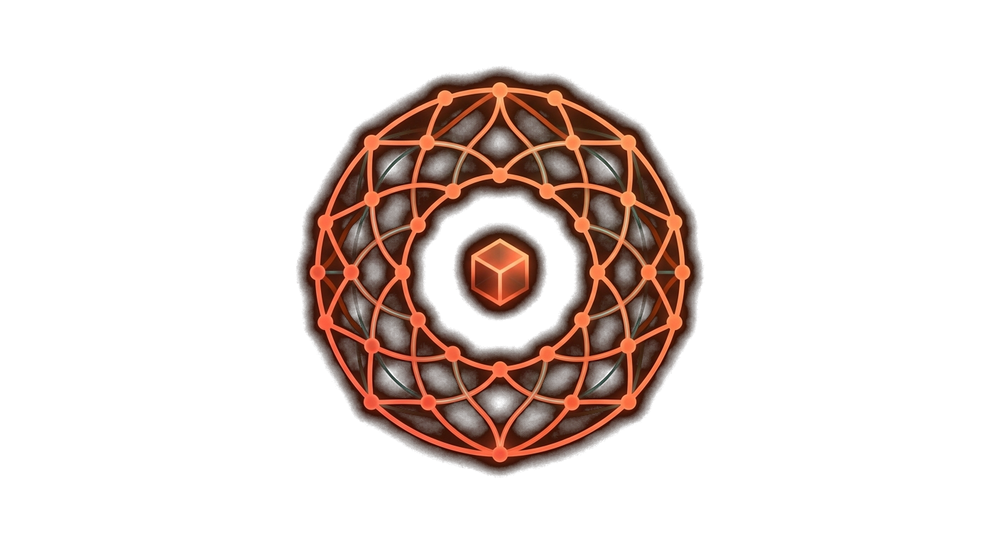

{ .section-emblem }

# Community

Plexus is built in the open because we love this stuff and we want the whole trading
community to have great, transparent infrastructure to build on. Read the protocol, run the
tools, write a plugin — it's all here.

## Repositories & wikis

Every open component has a repository and a wiki with the deep docs. We're publishing them
as the platform is carved into clean, independent projects, so a few links below are
**coming soon** while that lands.

| Component | What it is | Repo · Wiki |
|---|---|---|
| **plexus-protocol** | the wire spec, golden vectors, conformance harness | [repo](https://github.com/PlexusTradingLabs/plexus-protocol) · [wiki](https://github.com/PlexusTradingLabs/plexus-protocol/wiki) *(soon)* |
| **plexus-bus** | the bus, in Rust / Python / .NET | [rust](https://github.com/PlexusTradingLabs/plexus-bus-rust) · [python](https://github.com/PlexusTradingLabs/plexus-bus-python) · [dotnet](https://github.com/PlexusTradingLabs/plexus-bus-dotnet) *(soon)* |
| **plexus-nt** | the NinjaTrader connector | [repo](https://github.com/PlexusTradingLabs/plexus-nt) · [wiki](https://github.com/PlexusTradingLabs/plexus-nt/wiki) *(soon)* |
| **strategy SDKs** | the open strategy contracts | [python](https://github.com/PlexusTradingLabs/plexus-strategy-sdk) · [rust](https://github.com/PlexusTradingLabs/axon-strategy-sdk) *(soon)* |
| **PrismR plugin SDK** | the console-tab contract | [repo](https://github.com/PlexusTradingLabs/prismr-plugin-sdk) · [wiki](https://github.com/PlexusTradingLabs/prismr-plugin-sdk/wiki) *(soon)* |
| **this site** | the docs you're reading | [plexus-site](https://github.com/PlexusTradingLabs/plexus-site) |

[:fontawesome-brands-github: Browse the org](https://github.com/PlexusTradingLabs){ .md-button }

## Get involved

-   :fontawesome-brands-discord:{ .lg .middle } **Discord**

    ---

    Chat protocol, share plugins, swap strategies, and get help — our community Discord is
    launching soon.

    [:octicons-arrow-right-24: Join the Discord (coming soon)](#)

-   :material-message-question:{ .lg .middle } **Discussions**

    ---

    Questions about the protocol or writing a plugin? Open a discussion on the relevant
    repo — we'd love to hear what you're building.

-   :material-map:{ .lg .middle } **Roadmap**

    ---

    Live paper-trading and the sealed Axon engine are next. The Rust rewrite (PRISM + Axon)
    is in progress — ~10× the throughput, built for low-latency order flow.

-   :material-scale-balance:{ .lg .middle } **License**

    ---

    Open Plexus components are **MPL-2.0** — free to read, run, and build on. The trained
    Axon models stay proprietary; the open framework is genuinely yours.

-   :material-rocket-launch:{ .lg .middle } **Proven models**

    ---

    Want the proven, automated Axon AI models instead of building your own?

    [:octicons-arrow-right-24: plexustraders.com](https://plexustraders.com)

