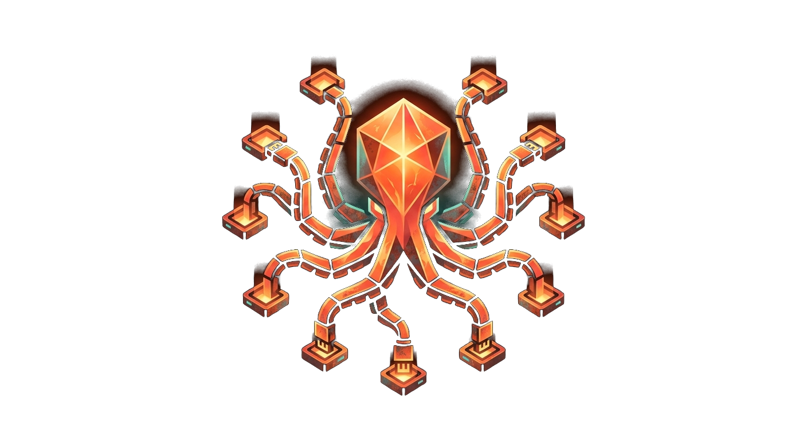
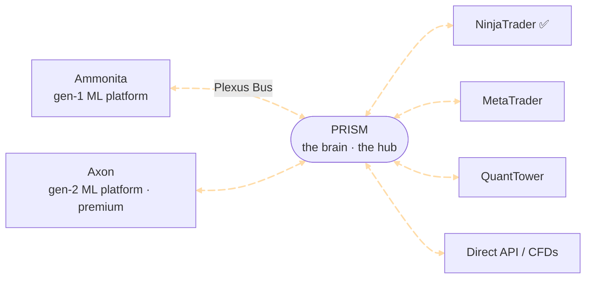

{ .section-emblem }

# Feed any trade client

Plexus is **platform- and market-agnostic by design** — one engine for **automated trading**
across any client and any market. PRISM is the brain; your trade client is the hand that
executes. It reaches NinjaTrader today, with the door open to MetaTrader, QuantTower, and
direct API access — for **futures, CFD, FX, and crypto** markets. Every new platform is the
same intelligence arriving in a brand-new market.

Everything connects through one hub: **PRISM** sits in the middle, our charting & ML
platforms (**Ammonita**, our first generation, and **Axon**, the premium next-gen) feed in
on one side, and your trade clients come off the other — all over the Plexus Bus.

## Trade clients

| Client | Status | How it connects |
|---|---|---|
| **NinjaTrader** | :material-check-circle:{ style="color:#3fb96b" } live | the `plexus-nt` connector — a bus-native NT 8 AddOn |
| **MetaTrader** | planned | a bus bridge (CFDs / FX) |
| **QuantTower** | planned | a bus connector |
| **Direct API** | planned | speak the Plexus Bus protocol directly |

## NinjaTrader

The open **plexus-nt** connector is a NinjaTrader 8 AddOn that wires your charts straight
into the Plexus Bus. Drop it in and NinjaTrader speaks Plexus — live data in, signals out.

[:fontawesome-brands-github: plexus-nt repo](https://github.com/PlexusTradingLabs/plexus-nt){ .md-button } &nbsp;
[:material-book-open-variant: Connector wiki](https://github.com/PlexusTradingLabs/plexus-nt/wiki){ .md-button } *(coming soon)*

---

Want a client we haven't built yet? It just needs to speak the
[Plexus Bus protocol](../protocol/index.md) — three open language implementations are ready
to build on. Or [**open a feature request on GitHub**](https://github.com/PlexusTradingLabs/plexus-nt/issues)
and tell us where you trade.
