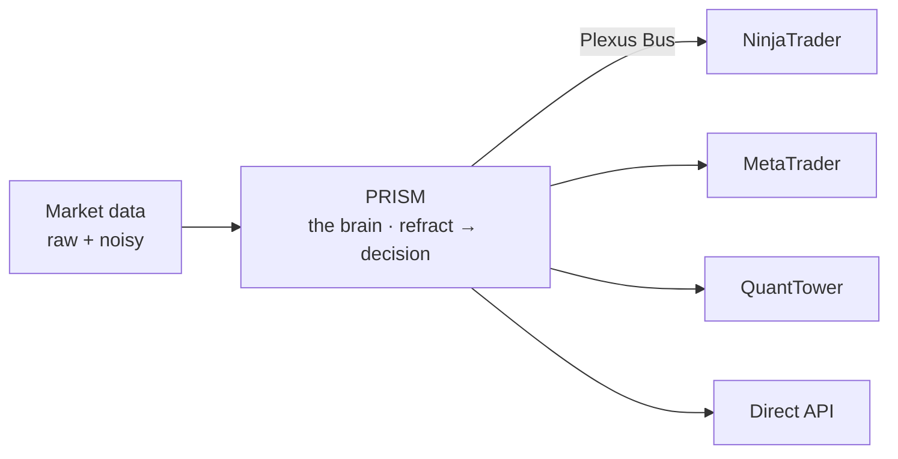

---
hide:
  - navigation
  - toc
---

# Distributed intelligence for the futures market

Plexus is an open protocol for AI and algorithmic trading strategies. Like an
octopus, the intelligence isn't locked in one head — it flows through a living network to
every arm: the market is read, refracted into a decision, and fired out to your trading
platform.

[Build on Plexus](overview/architecture.md){ .md-button .md-button--primary }
[Get the AI models →](https://plexustraders.com){ .md-button }

The framework and the plumbing are **open source and free** — transparency is the product.
The proven, premium AI models are available at **[PlexusTraders.com](https://plexustraders.com)**.

*PRISM is the brain at the center — it reads the market and drives every trade client over
the Plexus Bus. Our proven models run in the premium **Axon** platform (more below).*

## Why we open the framework

We open the **plumbing** — the protocol, the bus, the connectors, the plugin system — and
keep the **alpha** sealed. We're not handing out our winning models; we're giving the whole
trading community better rails to build on.

- **Contributing to trading.** Real, production-grade infrastructure — an open protocol and
  tools any developer, algorithmic trader, or quant can build on, not a toy.
- **Helping you win.** Connect your platform, write your own AI plugins, and run them on the
  exact rails we trade on. The framework makes you more capable, for free.
- **Trust through transparency.** The space is full of black boxes with hidden pricing and
  unverifiable "80% win-rate" claims. Read the protocol and run the tools yourself — so by
  the time you reach the premium models, you already know the system is real.

What stays private is the edge: the sealed **Axon** models at
[PlexusTraders.com](https://plexustraders.com). **Open system, private alpha.**

-   :material-lan:{ .lg .middle } **An open protocol**

    ---

    The Plexus Bus wire protocol, three conformant language implementations, and a
    public spec — the nervous system that connects every component.

    [:octicons-arrow-right-24: The protocol](protocol/index.md)

-   :material-puzzle:{ .lg .middle } **Bring your own strategy**

    ---

    Write a Python plugin against the PrismR daemon and tap the live bus — forecasting,
    ML, your own logic, running inside the free monitor.

    [:octicons-arrow-right-24: Write a plugin](prismr/plugins.md)

-   :material-connection:{ .lg .middle } **Feed any platform**

    ---

    Start with NinjaTrader; the engine is platform-agnostic by design. Every new
    platform is the same intelligence reaching a new market.

    [:octicons-arrow-right-24: Connect a client](connect/index.md)

-   :material-rocket-launch:{ .lg .middle } **Premium Axon models**

    ---

    When you want proven, automated edge: sealed, ML-trained Axon models, transparent
    pricing, no black boxes.

    [:octicons-arrow-right-24: PlexusTraders.com](https://plexustraders.com)

## Built for high-frequency trading (HFT)

Plexus speaks a custom binary wire protocol engineered for **high-frequency trading (HFT)**
and real-time **order-flow** analysis. On the hot path it negotiates **MessagePack** with a
content-addressed schema registry — a market-data bar drops from **~250 bytes of JSON to
~40 bytes**, around **80% smaller**. Across a 5-instrument feed at 10 bars/sec that's
**540 KB → 86 KB per minute**: the bandwidth and low-latency headroom that algorithmic and
automated trading at HFT speeds demand. Every message is HMAC-signed, with an optional
sealed transport for a fully closed bus.

The protocol is **market-agnostic** — the same engine drives **futures, CFD, FX, and crypto**
markets. We proved it in-house on a Python stack — the PRISM
coordinator plus our **Ammonita** engine — running everything from **backtesting** to the
live trading signals we run today. The **Rust** rewrite (PRISM + the sealed **Axon** engine)
is the next level: roughly **10× the throughput**, built for low-latency, high-frequency
futures, CFD, and crypto trading.

## The pieces, named after the system

| | | |
|---|---|---|
| **Plexus** | the nervous system | the open bus/protocol connecting every component |
| **PRISM** | the brain | refracts raw, noisy market data into a clear decision |
| **Axon** | the engine | our proprietary headless charting & ML platform — where our strategies and models run and backtest, with full access to charts and market data (premium) |

  The brain decides. The trading platform is just the
  hand that executes.

