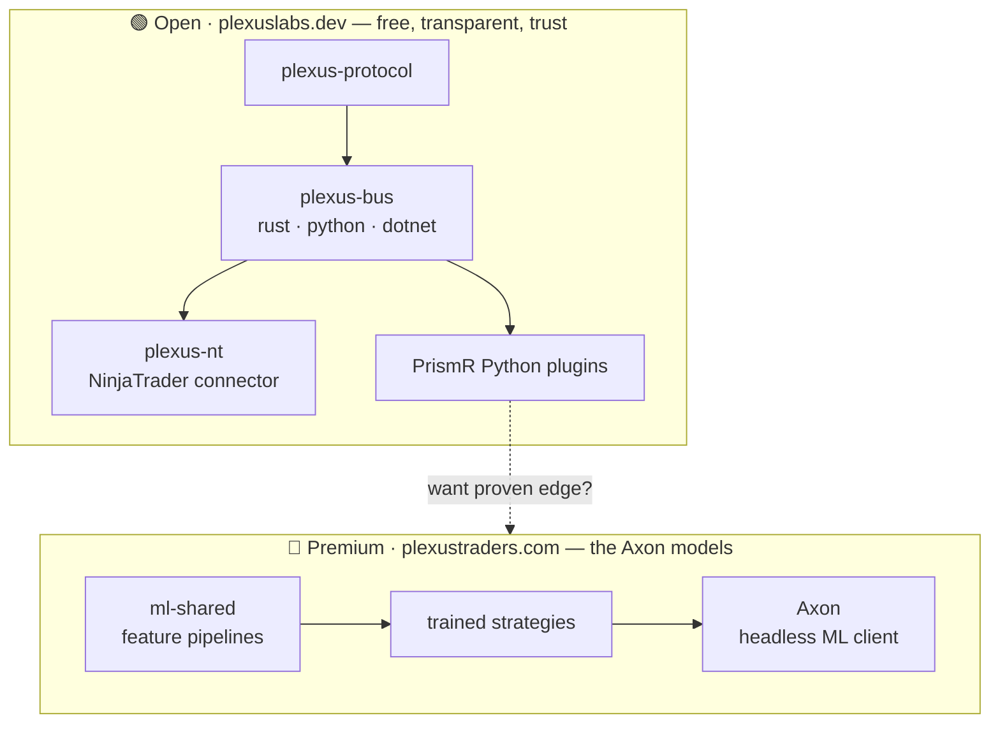
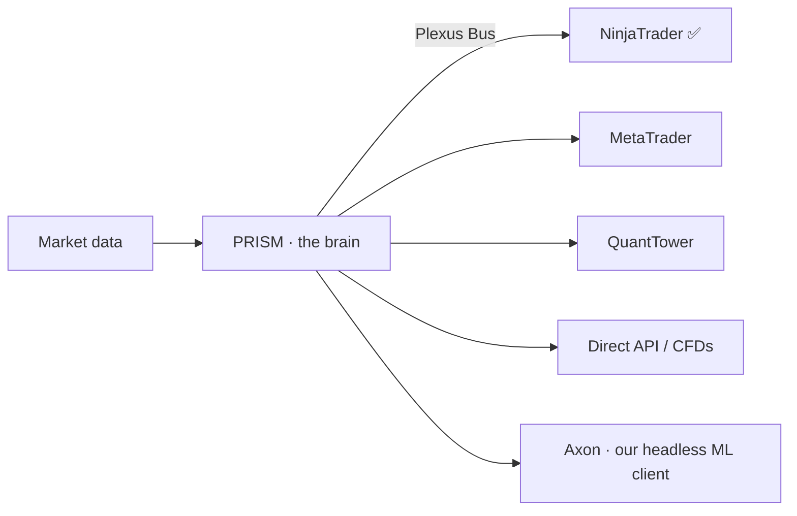

# Architecture

Plexus is a platform, not a single tool. A clean separation runs through everything:
the **open** framework that anyone can read and build on, and the **closed** intelligence
that is the product.

## The open on-ramp, the premium engine

Everything connects through the open bus contract, with **PRISM** as the brain at the
center — every trade client branches from it. You can build, connect, and verify entirely
on the open side. The premium, sealed **Axon** engine — our proprietary headless trade
client with a built-in ML engine — is the defensible moat, and lives behind
[PlexusTraders.com](https://plexustraders.com).

## What's open vs. premium

| Layer | Open (free) | Premium |
|---|---|---|
| **Protocol** | `plexus-protocol` — the wire spec + conformance | — |
| **Bus** | `plexus-bus` (Rust / Python / .NET) | — |
| **Connectors** | `plexus-nt` (NinjaTrader) | — |
| **Monitor** | PrismR — free binary + Python plugin API | PrismR Pro |
| **Engine** | bring-your-own plugin logic | **Axon** — sealed, ML-trained models |

## Platform-agnostic by design

NinjaTrader is the first window, not the only one. The same engine is built to reach
MetaTrader / CFDs, other trade clients, and direct API access. Each new platform is the
same intelligence arriving in a brand-new market — another arm of the octopus.

## From Python to Rust

We perfected the platform in-house on a Python stack — the PRISM coordinator plus the
**Ammonita** engine — and that's what we trade on today. The Rust rewrite (PRISM + the
sealed **Axon** engine) is the next level: roughly **10× the throughput**, with the low
latency high-frequency order-flow trading demands.

---

**Explore the open repositories →** every component above has its own repo and wiki, listed
on the [Community](../community.md#repositories-wikis) page.
