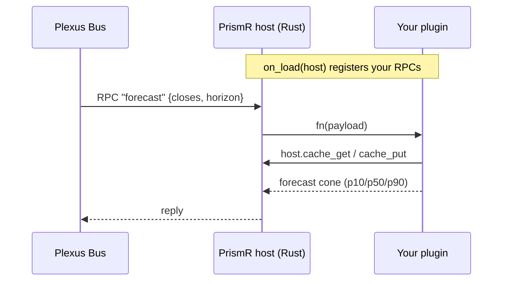

{ .section-emblem }

# Write a plugin for PrismR

**PrismR** is the free Plexus monitor — the operator console and daemon. Its daemon embeds
a Python interpreter and acts as a **general-purpose plugin host**, so you can write a
Python module that taps straight into the live bus: forecasting, ML, or your own logic.

!!! tip "This is the open builder path"
    You get the bus, dispatch, caching, and persistence for free from the Rust host. You
    write only your logic. It's real — and deliberately the entry-level path. For proven,
    production edge, the sealed **Axon** models live at
    [PlexusTraders.com](https://plexustraders.com).

## The plugin contract

A plugin is a small Python class. On load, it registers handlers with the host:

```python
class MyForecaster:
    name = "myforecaster"

    def on_load(self, host, config=None):
        # register an RPC the bus will route to you
        host.register_rpc("forecast", self._forecast)

    def _forecast(self, payload):
        closes  = payload["closes"]
        horizon = payload["horizon"]
        # cache + persistence come from the Rust host — no DB code in your plugin
        key = f"{closes[-1]}:{horizon}"
        if (hit := host.cache_get("forecast", key)) is not None:
            return hit
        cone = run_model(closes, horizon)      # your model here
        host.cache_put("forecast", key, cone)
        return cone

    def describe(self):                         # optional — powers the console panel
        from prism_host import ModuleInfo, Stat
        return ModuleInfo(status="LOADED", stats=[Stat("model", lambda: "chronos-bolt")])
```

The host hands you three bus hooks plus caching/persistence:

| Call | What it does |
|---|---|
| `host.register_rpc(name, fn)` | route bus RPC `name` to your function |
| `host.register_event_handler(type, fn)` | subscribe to a bus event type |
| `host.publish(event)` | publish an event onto the bus |
| `host.cache_get / cache_put / cache_clear` | namespaced cache + DuckDB persistence |

The full host API and plugin lifecycle reference lives in the
[prismr-plugin-sdk wiki](https://github.com/PlexusTradingLabs/prismr-plugin-sdk/wiki) *(coming soon)*.

## How it runs



## Tutorial: a forecasting plugin

A complete worked example — a time-series forecasting plugin using a public model
(Amazon's Chronos-Bolt) — is coming as the first end-to-end guide. It registers a
`forecast` RPC, caches via the host, and returns a p10/p50/p90 cone you can render in the
console.

<hr class="prism-rule">

**Want proven edge instead of DIY?** The premium Axon models are trained, sealed, and
transparently priced. [See PlexusTraders.com :octicons-arrow-right-24:](https://plexustraders.com){ .md-button .md-button--primary }
