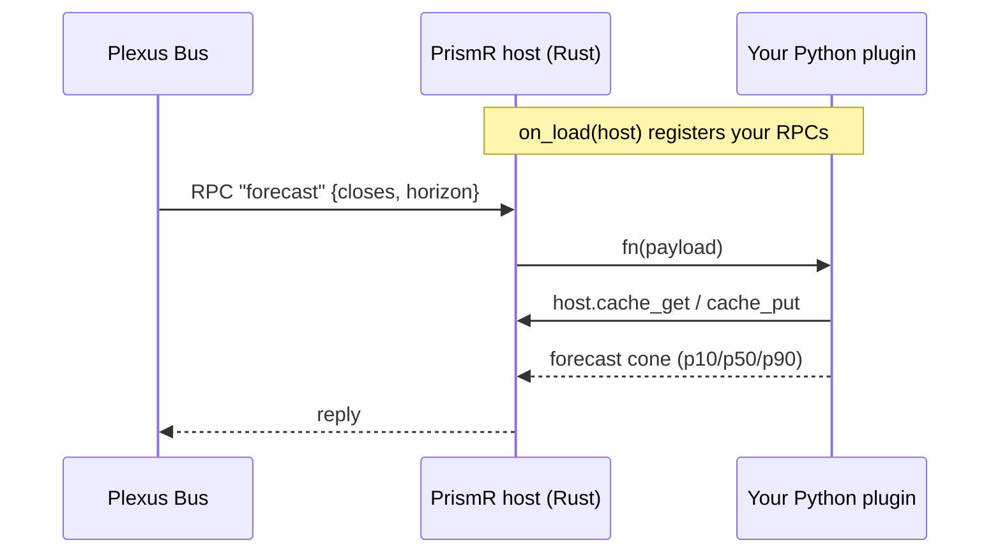

# The Plexus Bus

The **Plexus Bus** is the protocol at the heart of everything — the nervous system that
carries information between every component instantly. It is the reason a strategy, a
monitor, and a trade client written in three different languages all speak as one.

!!! note "Single source of truth"
    The full wire spec (`PROTOCOL.md`) lives in the
    [`plexus-protocol`](https://github.com/PlexusTradingLabs) repo, next to the golden
    vectors and the conformance harness that keep all three implementations in parity.
    This page renders it directly once the docs aggregation lane is wired (Phase 2).

## Three implementations, one protocol

The same wire protocol is implemented independently in three languages and kept in
lockstep by a conformance harness that tests the **published packages**, not co-located
source:

| Implementation | Package | Registry |
|---|---|---|
| Rust | `plexus-bus` | crates.io |
| Python | `plexus_bus` | PyPI |
| .NET | `Plexus.Bus` | NuGet |

## The plugin handshake

A Python plugin never touches a socket. It registers handlers with the Rust host; the bus
mechanics — dispatch, reply, security, metrics — are all handled for you.

[Write a plugin :octicons-arrow-right-24:](../prismr/plugins.md){ .md-button }
